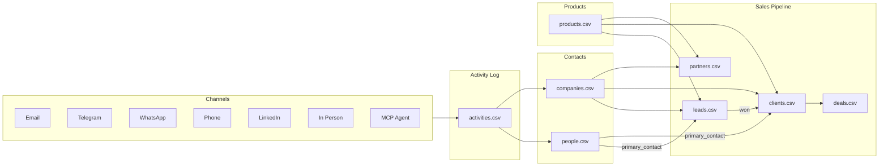
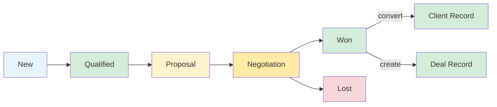
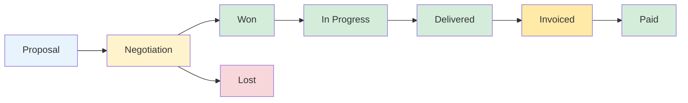
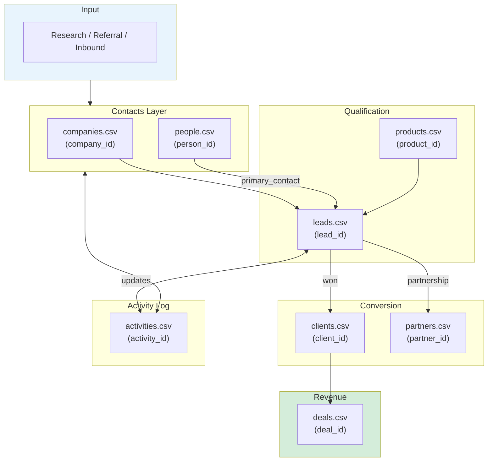
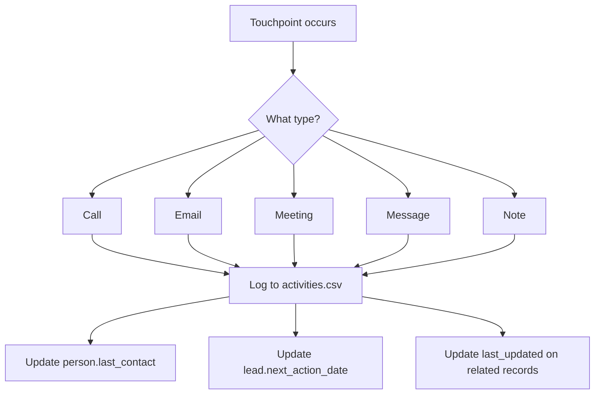

# CRM Flow -- System Map

## Overview



---

## Lead Pipeline



---

## Deal Lifecycle



---

## Data Flow



---

## Activity Tracking Flow



---

## File Map

```
sales/
├── crm/
│   ├── contacts/
│   │   ├── companies.csv        -- All companies (PK: company_id)
│   │   └── people.csv           -- All contacts (PK: person_id)
│   ├── products.csv             -- Products/services (PK: product_id)
│   ├── relationships/
│   │   ├── leads.csv            -- Sales pipeline (PK: lead_id)
│   │   ├── clients.csv          -- Active clients (PK: client_id)
│   │   ├── partners.csv         -- Partnerships (PK: partner_id)
│   │   └── deals.csv            -- Deals & invoices (PK: deal_id)
│   ├── activities.csv           -- All communications (PK: activity_id)
│   └── schema.yaml              -- Machine-readable validation rules
└── outreach/
    └── OUTREACH_PROMPT.md       -- Message templates
```

---

## Foreign Key Map

```
companies.csv
  ├──> people.csv (company_id)
  ├──> leads.csv (company_id)
  ├──> clients.csv (company_id)
  ├──> partners.csv (company_id)
  └──> activities.csv (company_id)

products.csv
  ├──> leads.csv (product_id)
  ├──> clients.csv (product_id)
  ├──> partners.csv (product_id)
  └──> activities.csv (product_id)

people.csv
  ├──> leads.csv (primary_contact_id)
  ├──> clients.csv (primary_contact_id)
  ├──> partners.csv (primary_contact_id)
  └──> activities.csv (person_id)

clients.csv
  └──> deals.csv (client_id)
```

---

## Key Metrics

| Metric | How to Calculate |
|--------|------------------|
| Pipeline value | Sum `estimated_value` where stage != won/lost |
| Active leads | Count leads where stage not in (won, lost) |
| Conversion rate | won / (won + lost) |
| Monthly revenue | Sum `mrr` from active clients |
| Outstanding invoices | Deals where stage = invoiced and paid_date is empty |
| Avg deal size | Mean `value` from deals where stage = paid |

---

## Integration Points

| Channel | Integration | Guide |
|---------|-------------|-------|
| **Telegram** | Telethon API | [Setup](../integrations/telegram_api.md) |
| **Gmail** | Gmail API | [Setup](../integrations/gmail.md) |
| **WhatsApp** | Baileys | [Setup](../integrations/whatsapp.md) |
| **LinkedIn** | Manual / CDP | [Setup](../integrations/linkedin.md) |
| **MCP Agents** | Model Context Protocol | [Setup](../integrations/mcp-agents.md) |
| **cursor-pm** | CSV cross-reference | [Setup](../integrations/cursor-pm.md) |
